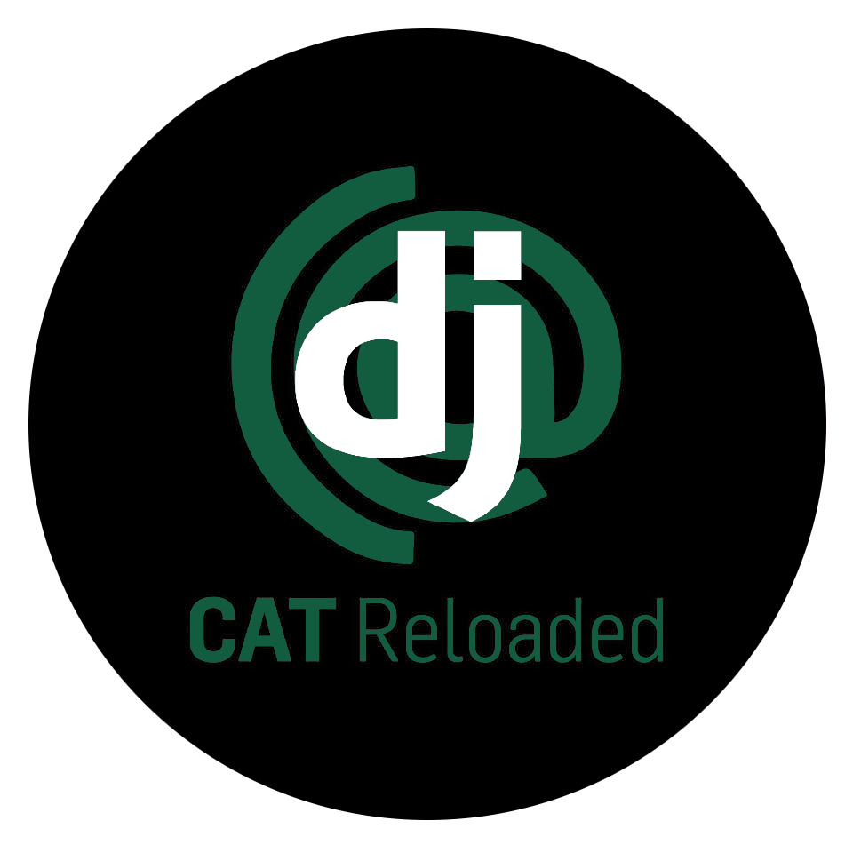
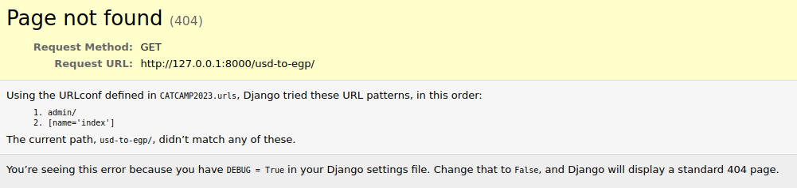

Welcome to the entry point to the back-end w/ Django workshop!

I hope it will be a fun ride for all the attendees 🙏

Although the tasks you'll see here are Django-related, 
- Previous knowledge of Django is not required.
- I'm intentionally throwing you into an ocean with those tasks, so don't feel stupid when you don't understand something!
- You don't have to solve all the tasks either! All I want you to do is to google and do your best 🫰
- We'll go through all of these again in the BootCamp.
- You may ask ChatGPT for help at any point. But please don't copy code or ask for straight answers. Use it to learn, not to solve. Instead of asking `Write the code for X`, try `explain X`. Remember that you're here to learn not to pass a test.

<b>Task 00: Fork the repo</b>

Let's start by forking this repository 😄

To solve the tasks, you'll either write code or edit this README to answer a question.

After that, push your code and submit the link to your forked repo.

**TASK:** Fork the repository.

 

<b>Task 01: Run the server</b>

Now that you forked the repo, don't be scared to tip your toes in :)

Your first task will be installing the environment and running the server, how about that?

**TASK:** Run the Django server and provide a screenshot of what you see here 👇

 

<b>HINTS:</b>

- Here's a cool tutorial on how to set up a Django Python environment: https://www.w3schools.com/django/django_getstarted.php
- You can find the command to start the server here: https://docs.djangoproject.com/en/4.1/intro/tutorial01/#the-development-server

 

<b>Task 02: URLconf</b>

Cool, you solved task 1 :) 
(sorry for the shitpost)

If you didn't, why did you click "Task 2" 😤 don't do that 😠 go back to "Task 1" now 🔪

I'm going to pretend that you solved task 1 🙈

---

For task 2, please run the local server and go to this url: http://127.0.0.1:8000/usd-to-egp/

If you see this: 

Then ✨ congratulations ✨, this is your first bug in Django 🎉

I'm expecting a certain page to be rendered for that URL. The code responsible for rendering this page is in `app/views.py:usd_to_egp`. Your task is to link that piece of code to the URL (`usd-to-egp/`). 

**TASK:** Configure the URLs in `app/urls.py` to render the code in `app/views.py:usd_to_egp`.  

<b>HINTS:</b>

- Read this tutorial: https://docs.djangoproject.com/en/4.1/intro/tutorial01/#write-your-first-view

 

 

<b>Task 03: A dynamic solution</b>

Looking at the code in `app/views.py:usd_to_egp`, you can see that the value in `context['usd_to_egp']` is hard coded.

Can you implement a more dynamic solution? I want the real-time rate of the currency exchange!

**TASK:** Use the real-time exchange rate of USD-EGP.

<b>HINTS:</b>

- Take a look at `app/utils.py` I wrote some code to help you 😉

 

<b>Task 04: On your own!</b>

Now for the final task, 

I want you to write your own `view` to render a webpage that shows the real-time price of Indome (بالخضار).

- You don't have to write any html, I already wrote it for you. You can find it at `templates/app/live-indomie-price.html`.
- The URL should be `/live-indomie-price/`.

**TASK:** Write a view that shows the real-time price of Indomie (بالخضار).

<b>HINTS:</b>

- I wrote a small piece of code that will help you get the real-time price. You can find it at `app/utils.py`.
- You can look at the code in `app/urls.py` and `app/views.py` for inspiration.

